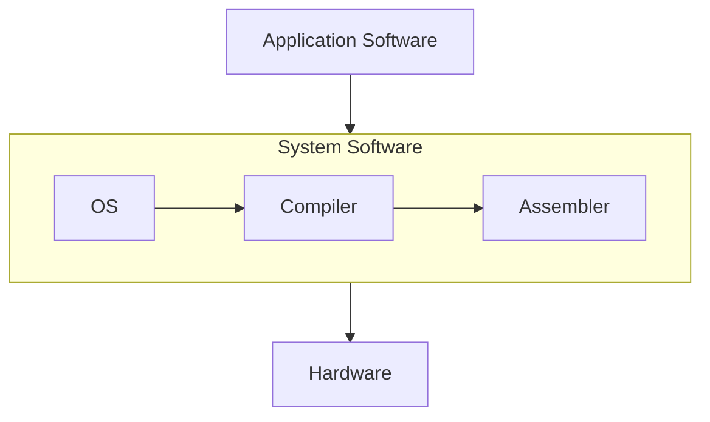

# Digital VLSI SoC Design & Planning
VLSI (Very Large Scale Integration) is the process of designing and manufacturing Integrated Circuits (ICs) that integrate thousands to billions of transistors onto a single silicon wafer. These transistors are interconnected to form highly complex circuits that perform specific functions, ranging from simple arithmetic operations to advanced data processing.
### VLSI design flow
 The VLSI design flow is a structured methodology for developing integrated circuits efficiently and effectively. It guides designers through key stages, including specification, design entry, synthesis, verification, layout, and fabrication. The flow aims to minimize design time while ensuring high-quality and reliable products. By breaking the process into manageable tasks, it helps focus on specific design aspects at each stage. This approach streamlines the workflow, reduces errors, and boosts team productivity.
<details>
  <summary><b>Typical design flow</b></summary>

  <p align="center">
    
  </p>

  1. **Design Specification**: Defines the functional and performance requirements of the design, including target performance and design constraints.
  2. **Behavioral Description**: Describes the system's functionality at a high level, focusing on what the system should do without detailing its hardware implementation.
  3. **RTL Description (HDL)**: Specifies the design using Hardware Description Language (HDL), detailing the logic and structure in a synthesizable form.
  4. **Functional Verification and Testing**: Ensures the design behaves as expected by simulating the RTL code and checking for correctness.
  5. **Logic Synthesis**: Transforms the RTL code into a gate-level representation, optimizing the design for area, power, and speed.
  6. **Gate-Level Netlist**: Produces a collection of logic gates and their interconnections, representing the synthesized design.
  7. **Logical Verification and Testing**: Verifies the gate-level design by running functional tests to check its correctness against the original specification.
  8. **Floor Planning, Automatic Place & Route**: Determines the physical placement of components on the chip and routes the interconnections to meet timing and area constraints.
  9. **Physical Layout**: Generates the final layout design, specifying the exact physical locations and connections for all components.
  10. **Layout Verification**: Ensures that the physical layout adheres to design rules and checks for issues such as signal integrity and manufacturability.
  11. **Implementation**: Finalizes the design for manufacturing by preparing the GDSII file, which is used in the fabrication process.

</details>

## Content
- [Day 1 - Inception of open-source EDA, OpenLANE and Sky130 PDK](#day-1---inception-of-open-source-eda-openlane-and-sky130-pdk)
- [Day 2 - Good floorplan vs bad floorplan and introduction to library cells](#day-2---good-floorplan-vs-bad-floorplan-and-introduction-to-library-cells)
- [Day 3 - Design library cell using Magic Layout and ngspice characterization](#day-3---design-library-cell-using-magic-layout-and-ngspice-characterization)
- [Day 4 - Pre-Layout timing analysis and importance and good clock tree](#day-4---pre-layout-timing-analysis-and-importance-and-good-clock-tree)
- [Day 5 - Final steps for RTL2GDS using tritonRoute and openSTA](#day-5---final-steps-for-rtl2gds-using-tritonroute-and-opensta)
## Day 1 - Inception of open-source EDA, OpenLANE and Sky130 PDK
### Section 1
Arduino is a popular example of an embedded development board which has ATMEGA328 microcontroller. Suppose we want to create an IC similar to this using the above flow. The GDSII obtained is sent to the foundry where the photomasks created for photolithography, a process used to etch the circuit patterns onto the silicon wafer. Multiple copies of the same circuit are etched onto the wafer, organized in a grid-like pattern. Once the circuits are fabricated onto the wafer, the wafer is cut into individual units. Each of these units is called a die. The die represents a complete integrated circuit (IC), and each **die** is a single functional unit of the circuit.
<p align="center">
  
  
</p>

The **die** is divided into two main sections: **pads** and the **core**.
-	**Pads**: These form the interface between the circuit and the external world. They enable electrical connections for power, ground, and input/output (I/O) signals.
-	**Core**: This houses the functional logic of the circuit. It comprises:
    -	**IPs** **(Intellectual Properties)**: Pre-designed and verified complex blocks (e.g., processors, memory, or communication interfaces) provided by vendors (foundries or EDA tool providers) or developed in-house. These require advanced techniques to integrate and function properly.
    -	**Macros**: Simpler blocks compared to IPs. These can be designed more easily and are often customized for specific functionalities.

**Foundry**: A **foundry** is a specialized manufacturing facility that produces semiconductor wafers and integrated circuits (ICs) designed by other companies.
After cutting, the individual dies are then encapsulated in a protective **package**. This is necessary for handling and connecting the die to the external world (such as through electrical pins or pads). The packages can be of different types. The most common IC package types are 
1.	Dual In-Line Package (DIP)
2.	Small Outline Package (SOP)
3.	Quad Flat Package (QFP)
4.	Quad Flat No-leads (QFN)
5.	Ball Grid Array (BGA)
6.	Chip Scale Package (CSP)
7.	Dual Flat No-leads (DFN)
8.	Quad Flat Package No-lead (QFN-ML)

**Instruction Set Architecture(ISA):**\
An Instruction Set Architecture (ISA) is the interface between a computer's hardware and software. It defines the set of instructions a processor can execute, including operations like arithmetic, data movement, and control flow. Example : x86, ARM , RISC-V

**The Bigger Picture:**

An application software that we use on PCs or mobiles are converted into binary language(machine code) by the system software which is then executed by the hardware.
System Software
-	**Operating System(OS)**
    -  Handle I/O operations, allocate memory, low level system functions
-	**Compiler**
    - Converts the application written in high level language(C, C++, Java) into assembly language of the respective ISA.
-	**Assembler**
    - The Assembly code from previous step is converted to binary language by the Assembler.

### Section 2
**Digital ASIC Design**
Requires several elements 
-	RTL IP’s
-	EDA Tools
-	PDK Data
  <p align="center">
    
  </p>
  
***Opensource RTL*** – Many opensource IP’s are available online. Some of the websites where they can be found are 
Librecores.org,
Opencores.org,
Github.com (github alone has 7000 repo).

***Opensource EDA Tools*** - Early EDA tools were result of academic requirements. Examples are Magic, Spice Simulator, qflow, OpenRoad, OpenLane.

***Open PDKs*** - In early days, the design of an IC was tightly integrated with the manufacturing processes available within each company. Those who controlled the physics controlled the creative agenda. Lynn Conway and Carver Mead envisioned the need for separating the design from technology;
Pioneered the "structured" design methodology based on the λ-based rules
Since then, we started to see Pure Play Fabs and Fabless design companies.  
What is PDK?  
PDK(Process Design Kit), is the interface b/w the FAB and the designers. Collection of files used to model a fabrication process for the EDA tools used to design an IC.
- Process Design Rules : DRC, LVS, PEX
- Device Models
- Digital Standard Cell Libraries
- I/O Libraries  
They are distributed under NDA, made difficult for mass production. Google partnered with skywater and release open source PDK skywater130. This is 130nm process, it may seem old/irrelevant but most applications don't need the advanced nodes due to high cost of production. The market share is as shown below.
  <p align="center">
    
  </p>
The 6%, which amounts to 4.7B annual revenue. In terms of performance, the following examples will convince you!!
  <p align="center">
    
  </p>
  
**Simplified ASIC design flow**
  <p align="center">
    
  </p>
  
***Synthesis :*** Design RTL is converted to circuit made out elements from standard cell library. The resultant circuit is described in HDL and usually referred to as the gate level netlist. A gate level netlist Is functionally equivalent to the RTL.  
The library building blocks for the cells have regular layouts typically the cell layout of fixed heights rectangle with is variable but discrete integer multiple of a fixed value called site width. Each cell comes with different view/models.  
-	Electrical (liberty format; delay, power models), HDL (behavioral), SPICE(cdl),
-	Layout (Abstract(lef) and detailed(gdsii))
  <p align="center">
    
  </p>
  
***Floor and Power planning :*** Depends on whether a macro or entire chip. The objective is to plan Silicon area and create robust power distribution network to power the circuit.  
Chip floor planning: Partition the chip die into different system building blocks and place the I/O pads.  
  <p align="center">
    
  </p>
Macro Floor planning: Dimensions, pin locations, row definitions  
  <p align="center">
    
  </p>
  
***Power planning***
  <p align="center">
    
  </p>
Uses upper metal layers as they are thicker than lower metal layers hence have lower resistance.  

***Placement :*** Place the cells on the floorplan rows aligned with the sites. In 2 types; global and detailed. Finds optimal position for the cells May not be legal. The positions are legalized by making minor adjustments  to the position of the cells.
  <p align="center">
    
  </p>
  <p align="center">
    
  </p>
  
***lock Tree synthesis :***
Create a clock distribution network
-	To deliver the clock to all sequential elements (e.g., FF).
-	With minimum skew (zero is hard to achieve).
-	And in good shape
-	Usually a Tree (H, X, …).
  <p align="center">
    
  </p>

***Routing :***
Implement the interconnect using the available metal layers, the PDK defines the thickness pitch, tracks and the minimum width.
  <p align="center">
    
  </p>
  
Skywater130 :
This PDK defines 6 routing layers, lowest called local interconnect layer (TitaniumNitride layer), the following layers are all Aluminum.  
Metal tracks form a routing grid  
Routing grid is huge  
Divide and Conquer
-	Global Routing: Generates the routing guides
-	Detailed Routing: Uses the routing guides to implement the actual wiring

***Signoff :***
Once done with routing we can construct the final layout, which undergoes verification that includes,  
- Physical Verification
  - Design rule checking(DRC)
  - Layout v/s Schematic(LVS)
- Timing Verification
  - Static Timing Analysis(STA)

**OpenLANE :** Can I build a chip using this flow?  
This flow can be used with commercial EDA Tools. The problem is tougher when using opensource EDA
- Tools qualification
- Tools calibration
- Missing tools
Open lane is a reference ASIC flow by efabless public repo on github. Started as an open-source flow for a true open source tape-out experiment.
striVe si a family of open everything SoCs
-	Open PDK, Open EDA, Open RTL
  <p align="center">
    
  </p>
  
**Main goal of OpenLane:**
- Produce a clean GDSII with no human intervention (no-human-in-the-loop). Clean means:
  -	No LVS violations
  -	No DRC violations
  -	Timing violations? WIP!
- Tuned for SkyWater 130nm Open PDK  
  -	Also supports XFAB180 and GF130G
- Containerized  
  -	Functional out of the box
  -	Instructions to build and run natively will follow
- Can be used to harden macros and chips  
- Two modes of operation:
  -	Autonomous or Interactive
- Design Space Exploration  
  - Find the best set of flow configurations.  
- Large number of design examples  
  -	43 designs with their best configurations
  -	More will be added soon

**Open lane ASIC design flow:**
  <p align="center">
    
  </p>
  
The flow starts with the design RTL and ends with the final layout in the GDSII format. To function it  needs the PDK. Open lane is based on several open source projects such as openRoad Yosys, ABC, QFlow, Fault, etc.  

***RTL synthesis:*** the RTL is fed to yosys along with design constraints. Yosys translates the RTL into a logic circuit using generic components. This circuit can be optimized and mapped into cells from SCL using ABC. ABC has to be guided during the optimization and this guidance comes in the form of ABC script. Openlane comes with several ABC scripts. With different synthesis strategies. We have strategies that targets area, timing, etc. Different strategies can be used to obtain the required objectives. Synthesis exploration utilities that can be used to generate a report that shows how the design delay and area is affected by the synthesis strategy, based on this we can pick the best synthesis strategy to continue with.  

Also openlane has design exploration utilities which can be used to sweep the design configurations and generates a report, which shows design metrics 
  <p align="center">
    
  </p>

The design exploration utility is also used for regression testing(CI)
We run openlane on ~70 designs and compare the results to the best known ones  
  <p align="center">
    
  </p> 
  
**Design for Testing :** After synthesis comes the testing structure insertion, if we want our design to be ready for  testing after fabrication  we can enable this step which is optional. This step uses opensource project fault to perform 
-	Scan insertion
-	Automatic Test Pattern Generation (ATPG)
-	Test Patterns Compaction
-	Fault Coverage
-	Fault Simulation
  <p align="center">
    
  </p> 
  
Adds extra logic, scan chain and data controller- access to scan chain  

**Physical Implementation :** Also called automated PnR (Place and Route). We use openRoad app.    
-	Floor/Power Planning
-	End Decoupling Capacitors and Tap cells insertion
-	Placement: Global and Detailed 
-	Post placement optimization
-	Vlock Tree Synthesis(CTS)
-	Routing : Global and Detailed.

**Logic equivalence checking(LEC)** using yosys: since the netlist generated from synthesis modigied by the optimizations, Logic equivalence check must be performed to ensure the functional equivalence
Everytime the netlist is modified, verification must be performed
-	CTS modifies the netlist
-	Post Placement optimizations modifies the netlist
LEC is used to formally confirm that the function did not change after modifying the netlist.

**Antenna Rules Violation**  
When a metal wire segment is fabricated, it can act as an antenna
-	Reactive ion etching causes charge to accumulate on the wire
-	Transistor gates can be damaged during the fabrication process.
  <p align="center">
    
  </p> 

Two solutions:
-	Bridging attaches a higher layer intermediary
  -	Requires router awareness(not there yet)
-	Add antenna diode cell to leak away charges 
  - Antenna diodes are provided by the SCL.
  <p align="center">
    
  </p> 
  <p align="center">
    
  </p> 

We took a preventive approach
-	Add a Fake antenna diode next to every cell input after placement
-	Run the Antenna checker (Magic) on the routed layout
-	If the checker reports a violation on the cell input pin, replace the Fake diode cell by a real one.
Openlane has a configuration to select one of the two approaches to handle the antenna violations.
  <p align="center">
    
  </p> 
  
**Signoff :** STA, DRC, LVS
-	RC Extraction: DEF2SPEF
-	STA: OpenSTA (OpenROAD)
-	Magic si used for Design Rules Checking and the SPICE Extraction from Layout
-	Magic and Netgen are used for LVS
  -	Extracted SPICE by Magic vs Verilog netlist.


### Section 3
  [Directory Structure](directory_structure.md)  Click at your own risk :)

  T
  
```bash
# cd into the openlane directory
cd Desktop/work/tools/openlane_working_dir/openlane

# Run the docker command to invoke the OpenLANE Docker container
docker

```
```tcl
# Launch the OpenLANE flow in interactive mode(-interactive switch is used to view the intermediate results)
./flow.tcl -interactive

# Import the required package
package require openlane 0.9

# Prepare the design environment for 'picorv32a' by creating necessary files and directories
prep -design picorv32a

# Run synthesis for the prepared design
run_synthesis

# Exit the OpenLANE flow interface
exit

# Exit the Docker container
exit

```
  

## Day 2 - Good floorplan vs bad floorplan and introduction to library cells
## Day 3 - Design library cell using Magic Layout and ngspice characterization
## Day 4 - Pre-Layout timing analysis and importance and good clock tree
## Day 5 - Final steps for RTL2GDS using tritonRoute and openSTA
