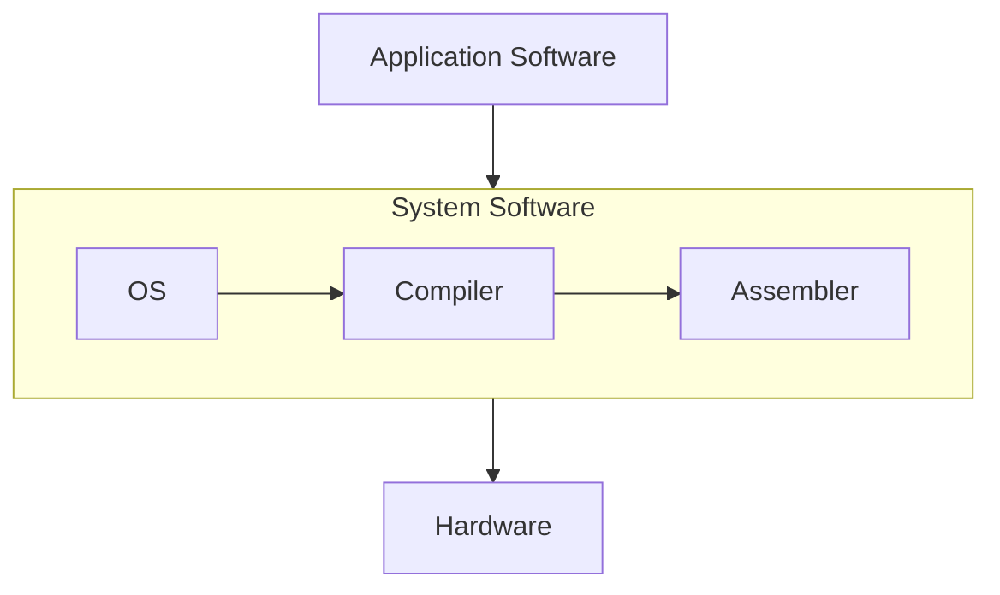

# Digital VLSI SoC Design & Planning
VLSI (Very Large Scale Integration) is the process of designing and manufacturing Integrated Circuits (ICs) that integrate thousands to billions of transistors onto a single silicon wafer. These transistors are interconnected to form highly complex circuits that perform specific functions, ranging from simple arithmetic operations to advanced data processing.
### VLSI design flow
 The VLSI design flow is a structured methodology for developing integrated circuits efficiently and effectively. It guides designers through key stages, including specification, design entry, synthesis, verification, layout, and fabrication. The flow aims to minimize design time while ensuring high-quality and reliable products. By breaking the process into manageable tasks, it helps focus on specific design aspects at each stage. This approach streamlines the workflow, reduces errors, and boosts team productivity.

  
Typical design flow

  

    
  

  1. **Design Specification**: Defines the functional and performance requirements of the design, including target performance and design constraints.
  2. **Behavioral Description**: Describes the system's functionality at a high level, focusing on what the system should do without detailing its hardware implementation.
  3. **RTL Description (HDL)**: Specifies the design using Hardware Description Language (HDL), detailing the logic and structure in a synthesizable form.
  4. **Functional Verification and Testing**: Ensures the design behaves as expected by simulating the RTL code and checking for correctness.
  5. **Logic Synthesis**: Transforms the RTL code into a gate-level representation, optimizing the design for area, power, and speed.
  6. **Gate-Level Netlist**: Produces a collection of logic gates and their interconnections, representing the synthesized design.
  7. **Logical Verification and Testing**: Verifies the gate-level design by running functional tests to check its correctness against the original specification.
  8. **Floor Planning, Automatic Place & Route**: Determines the physical placement of components on the chip and routes the interconnections to meet timing and area constraints.
  9. **Physical Layout**: Generates the final layout design, specifying the exact physical locations and connections for all components.
  10. **Layout Verification**: Ensures that the physical layout adheres to design rules and checks for issues such as signal integrity and manufacturability.
  11. **Implementation**: Finalizes the design for manufacturing by preparing the GDSII file, which is used in the fabrication process.

## Content
- [Day 1 - Inception of open-source EDA, OpenLANE and Sky130 PDK](#day-1---inception-of-open-source-eda-openlane-and-sky130-pdk)
- [Day 2 - Good floorplan vs bad floorplan and introduction to library cells](#day-2---good-floorplan-vs-bad-floorplan-and-introduction-to-library-cells)
- [Day 3 - Design library cell using Magic Layout and ngspice characterization](#day-3---design-library-cell-using-magic-layout-and-ngspice-characterization)
- [Day 4 - Pre-Layout timing analysis and importance and good clock tree](#day-4---pre-layout-timing-analysis-and-importance-and-good-clock-tree)
- [Day 5 - Final steps for RTL2GDS using tritonRoute and openSTA](#day-5---final-steps-for-rtl2gds-using-tritonroute-and-opensta)
## Day 1 - Inception of open-source EDA, OpenLANE and Sky130 PDK
### L1
Arduino is a popular example of an embedded development board which has ATMEGA328 microcontroller. Suppose we want to create an IC similar to this using the above flow. The GDSII obtained is sent to the foundry where the photomasks created for photolithography, a process used to etch the circuit patterns onto the silicon wafer. Multiple copies of the same circuit are etched onto the wafer, organized in a grid-like pattern. Once the circuits are fabricated onto the wafer, the wafer is cut into individual units. Each of these units is called a die. The die represents a complete integrated circuit (IC), and each **die** is a single functional unit of the circuit.

  
  

The **die** is divided into two main sections: **pads** and the **core**.
-	**Pads**: These form the interface between the circuit and the external world. They enable electrical connections for power, ground, and input/output (I/O) signals.
-	**Core**: This houses the functional logic of the circuit. It comprises:
    -	**IPs** **(Intellectual Properties)**: Pre-designed and verified complex blocks (e.g., processors, memory, or communication interfaces) provided by vendors (foundries or EDA tool providers) or developed in-house. These require advanced techniques to integrate and function properly.
    -	**Macros**: Simpler blocks compared to IPs. These can be designed more easily and are often customized for specific functionalities.

**Foundry**: A **foundry** is a specialized manufacturing facility that produces semiconductor wafers and integrated circuits (ICs) designed by other companies.
After cutting, the individual dies are then encapsulated in a protective **package**. This is necessary for handling and connecting the die to the external world (such as through electrical pins or pads). The packages can be of different types. The most common IC package types are 
1.	Dual In-Line Package (DIP)
2.	Small Outline Package (SOP)
3.	Quad Flat Package (QFP)
4.	Quad Flat No-leads (QFN)
5.	Ball Grid Array (BGA)
6.	Chip Scale Package (CSP)
7.	Dual Flat No-leads (DFN)
8.	Quad Flat Package No-lead (QFN-ML)

**Instruction Set Architecture(ISA):**\
An Instruction Set Architecture (ISA) is the interface between a computer's hardware and software. It defines the set of instructions a processor can execute, including operations like arithmetic, data movement, and control flow. Example : x86, ARM , RISC-V

**The Bigger Picture:**

An application software that we use on PCs or mobiles are converted into binary language(machine code) by the system software which is then executed by the hardware.
System Software
-	**Operating System(OS)**
    -  Handle I/O operations, allocate memory, low level system functions
-	**Compiler**
    - Converts the application written in high level language(C, C++, Java) into assembly language of the respective ISA.
-	**Assembler**
    - The Assembly code from previous step is converted to binary language by the Assembler.

### 
## Day 2 - Good floorplan vs bad floorplan and introduction to library cells
## Day 3 - Design library cell using Magic Layout and ngspice characterization
## Day 4 - Pre-Layout timing analysis and importance and good clock tree
## Day 5 - Final steps for RTL2GDS using tritonRoute and openSTA
